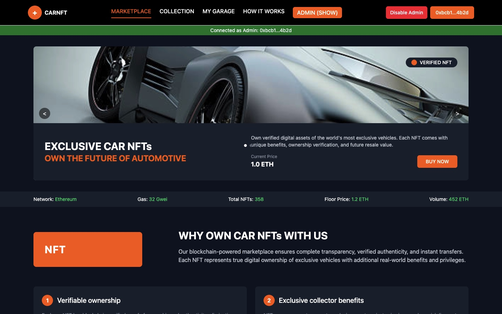

# CARNFT Marketplace

CARNFT is a blockchain-powered marketplace for exclusive car NFTs, allowing users to buy, sell, and collect digital assets representing luxury vehicles.




## Features

- **Verified Car NFTs**: Authentic digital assets of exclusive vehicles with blockchain verification
- **Marketplace**: Browse, buy, and sell car NFTs
- **Admin Controls**: Mint new NFTs with vehicle details and images
- **Wallet Integration**: Connect your Ethereum wallet for transactions
- **Collection Management**: View and manage your NFT collection in "My Garage"

## Tech Stack

- React.js for the frontend UI
- Ethereum blockchain for NFT storage and transactions
- Ethers.js for blockchain interaction
- IPFS for decentralized storage of NFT metadata and images
- Tailwind CSS for styling

## Getting Started


### Installation

1. Clone the repository:
   ```bash
   git clone https://github.com/Anuoluwapo25/CarDealers_Marketplace.git
   cdCarDealers_Marketplace
   ```

2. Install dependencies:
   ```bash
   npm install
   ```

3. Create a `.env` file in the root directory with the following variables:
   ```
   REACT_APP_CONTRACT_ADDRESS=your_contract_address
   REACT_APP_INFURA_PROJECT_ID=your_infura_project_id
   REACT_APP_IPFS_PROJECT_ID=your_ipfs_project_id
   REACT_APP_IPFS_PROJECT_SECRET=your_ipfs_project_secret
   ```

4. Start the development server:
   ```bash
   npm run dev
   ```

5. Open [http://localhost:3000](http://localhost:3000) in your browser


## Smart Contract Deployment (Using Foundry)

1. Navigate to the `contracts` directory:
   ```bash
   cd contracts
   ```

2. Build the contracts:
   ```bash
   forge build
   ```

3. Deploy contracts (replace `<network-url>` and `<private-key>` with your values):
   ```bash
   forge create --rpc-url <network-url> --private-key <your-private-key> src/NFTmarket.sol:NFTmarket
   ```

4. Update the deployed contract address in your `.env` file.
## Usage

### Connecting Your Wallet

1. Click the "CONNECT WALLET" button in the navigation bar
2. Approve the connection request in your wallet (MetaMask, etc.)
3. Once connected, your wallet address will be displayed

### Browsing NFTs

1. Scroll through the featured NFTs on the homepage
2. View additional details by clicking on specific NFTs
3. Use the slider to browse through featured car NFTs

### Purchasing an NFT

1. Make sure your wallet is connected
2. Browse available NFTs marked "FOR SALE"
3. Click "BUY NOW" on the desired NFT
4. Confirm the transaction in your wallet
5. Once confirmed, the NFT will be transferred to your wallet

### Admin Functions

Admin functions are restricted to authorized addresses.

1. Enable admin mode (for authorized addresses)
2. Click "ADMIN (SHOW)" to display the minting form
3. Fill in the car details:
   - Address to mint to
   - Make, model, and year
   - Price (in ETH)
   - Description
   - Upload a car image
4. Click "Mint NFT" to create the new NFT
5. After successful minting, you can list the NFT for sale

## Development


## Testing

### Frontend Tests

```bash
npm test

```

### Smart Contract Tests (Foundry)

1. Navigate to the `contracts` directory:
   ```bash
   cd contracts
   ```

2. Run tests:
   ```bash
   forge test
   ```

## Contributing

1. Fork the repository
2. Create a new branch (`git checkout -b feature/amazing-feature`)
3. Commit your changes (`git commit -m 'Add some amazing feature'`)
4. Push to the branch (`git push origin feature/amazing-feature`)
5. Open a Pull Request

## License

This project is licensed under the MIT License - see the LICENSE file for details.

## Contact

Your Name - [@ali_anuoluwapo](https://x.com/ali_anuoluwapo)

Project Link: [https://carmarketplace-opal.vercel.app/](https://carmarketplace-opal.vercel.app/)

## Acknowledgments

- OpenZeppelin for secure smart contract implementations
- IPFS for decentralized storage solutions
- Tailwind CSS for the UI framework
